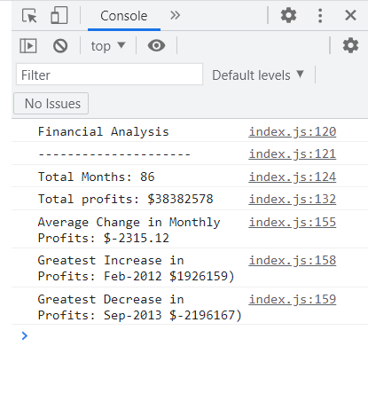

# JavaScript Financial Analysis in Web Browser Console (Challenge-Week 4)

## Description
The purpose of this project was to write JavaScript code that would undertake an analysis of financial data for a company. Specifically, the code indicates the number of months covered by the data; the total profits made during this period; average changes in profit from month to month; and indicates the months of greatest increase and decrease in profit. Two 'for' loops are used to make these calcuations. The first extracts all the financial data from an array and provides a figure for total profits. The second 'for' loop calculates a combined sum of all the monthly changes in profit which can later be divided for an average. This loop also contains two conditional statements which extract figures for the greatest increase and decrease in profits, and which identify the months where these occurred. The financial analysis can be accessed through a printout in the browser console.

## Installation
N/A

## Usage
To access the financial analysis performed by this webpage's JavaScript right-click anywhere on the webpage and, when a menu appears, select 'Inspect'. Click the double arrow '>>' key adjacent to 'Elements' and select 'Console'. The financial analysis will appear below. These instructions apply to PC users viewing this page in Chrome. For Mac users press: Command+Option+I to access 'Inspect'. For instructions to access 'Inspect' in other web browsers users may consult this webpage: https://blog.hubspot.com/website/how-to-inspect

## Credits
N/A

## License
N/A

## https://davidbluelamassu.github.io/Console-Finances/

